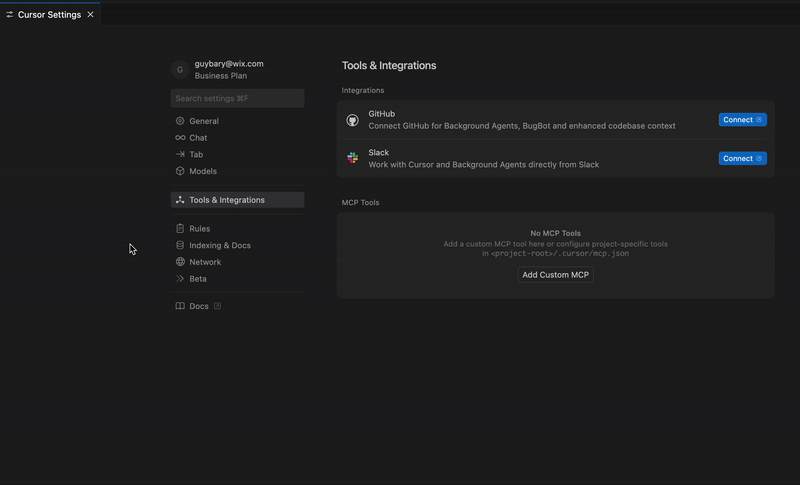

# Octocode MCP

**The Perfect AI Code Assistant - Advanced Search & Discovery Across GitHub & NPM**

<div>
  
  
  [](./package.json)
  [](./package.json)
  [](https://modelcontextprotocol.io/)
</div>

## What is Octocode? 🐙

**The perfect code assistant that can help understand anything.** Octocode was built to understand connections between repositories and NPM packages under any privilege level you have. With **AI-powered advanced search**, heuristic discovery, and smart fallbacks, it makes GitHub's vast repository of knowledge truly searchable and analyzable.

Instead of manually browsing repositories, you can ask questions like:

- *"How did React implement concurrent rendering?"*
- *"Show me authentication patterns in Next.js applications"*
- *"Find examples of how to use this specific API"*
- *"What's the architecture of this library?"*
- *"How do I use this MCP tool effectively?"*

## Recommended Use Cases

**Use Octocode when you need to:**

- **🔍 Understand implementations** - See how features work across different repositories
- **📚 Find real code examples** - Discover patterns and best practices from production code  
- **🏗️ Analyze architecture** - Explore how systems are designed and structured
- **🔬 Research approaches** - Compare different implementation strategies
- **💡 Learn from code** - Deep-dive into technical details and understand "how does this work?"

## Unique Value Proposition

**The most advanced AI-powered code assistant for understanding connections across the entire GitHub & NPM ecosystem.** While other GitHub MCPs focus on project management or basic operations, Octocode provides unparalleled depth for code discovery and technical research.

**🚀 Out-of-the-Box Advanced Search (Powered by AI):**
- **🧠 Heuristic Search** - Intelligent pattern recognition that finds relevant code even with vague queries
- **🔄 Smart Fallbacks** - Automatic retry with alternative search strategies when initial searches fail
- **🎯 Smart Discovery** - AI-guided exploration that uncovers hidden connections and patterns
- **🔗 Connection Intelligence** - Understands relationships between repositories, packages, and dependencies
- **📊 Multi-dimensional Analysis** - Combines code, commits, issues, discussions, and package data

**Key Differentiators:**
- **🧠 Advanced AI Search** - Heuristic algorithms that understand code context and connections
- **🔐 Secure & Simple** - No personal access tokens needed, uses [GitHub CLI](https://cli.github.com/) authentication
- **🔗 Connected Discovery** - Maps NPM packages to repositories, traces dependencies, finds related code
- **🌐 Cross-Ecosystem Understanding** - Works across any privilege level you have (public, private, organization)

It's the tool you reach for when you need to understand *"how does this work?"* rather than *"how do I manage this project?"*

## Quick Start 🚀

### 1. Install Prerequisites
```bash
# Install Node.js 18.12+
brew install node  # macOS
# or download from https://nodejs.org/

# Install GitHub CLI
brew install gh    # macOS
# or see: https://github.com/cli/cli#installation
```

### 2. Authenticate
```bash
# Login to GitHub (opens browser)
gh auth login

# Login to NPM (for package research)
npm login
```

**🔐 GitHub Authentication via CLI:**
- ✅ **No personal access tokens needed** - Uses [GitHub CLI](https://cli.github.com/) behind the scenes
- ✅ **Secure OAuth flow** - Browser-based authentication, no tokens to store
- ✅ **Enterprise ready** - Works with SSO, 2FA, and organization access
- ✅ **Private repository access** - Automatically detects your organizations and accesses private repos
- ✅ **Zero configuration** - Uses your existing `gh` CLI permissions


### 3. Add to MCP Configuration
```json
{
  "octocode-mcp": {
    "command": "npx",
    "args": ["octocode-mcp"]
  }
}
```

**That's it!** No personal access tokens, no config files, no complex setup. Octocode leverages [GitHub CLI](https://cli.github.com/) authentication behind the scenes and **automatically works with your organization's private repositories**.




## How Octocode Works 🔄

**Smart Discovery Flow:**
1. **🔍 Query Analysis** → AI determines the best search strategy based on your question
2. **⚡ Multi-Tool Orchestration** → Combines GitHub + NPM searches intelligently
3. **🔄 Smart Fallbacks** → Automatically retries with different approaches if initial search fails
4. **🔗 Cross-Reference Discovery** → Links packages to repositories, finds related implementations
5. **🎯 Context Synthesis** → Provides comprehensive understanding across multiple sources

## Example Flows

### Example 1: LangGraph Node.js Implementation Tutorial
**Query:** "Show implementations of langgraph in node js. Make a tutorial for how to implement a simple agent using OpenAI API."


### Example 2: Zustand React State Management
**Query:** "Show me how to add zustand to react application. Show examples and best practices"


### Example 3: React vs Vue.js Rendering Comparison
**Query:** "How did React implement their concurrent rendering flows? How is it different from Vue.js rendering mechanism? Which is better?"


## Core Features 🛠️

### 🧠 AI-Powered Advanced Search
- **Heuristic Pattern Recognition** - Finds relevant code even with vague or incomplete queries
- **Smart Fallback Strategies** - Automatically tries alternative approaches when searches fail with actionable suggestions
- **Boolean Search Intelligence** - Automatic query optimization with smart boolean operators (3-5x performance improvement)
- **Context-Aware Discovery** - Understands code relationships and suggests related implementations
- **Multi-Strategy Search** - Combines semantic, syntactic, and dependency-based search methods
- **Graceful Error Recovery** - Comprehensive error handling with intelligent retry mechanisms

### 🔗 Connection Intelligence
- **Repository-Package Mapping** - Automatically links NPM packages to their GitHub repositories
- **Dependency Tracing** - Follows dependency chains across the entire ecosystem
- **Cross-Reference Analysis** - Finds how different projects implement similar patterns
- **Ecosystem Understanding** - Maps relationships between libraries, frameworks, and tools

### 🌐 Universal Access & Discovery
- **Cross-Privilege Search** - Works with any access level you have (public, private, organization)
- **Organization-Aware** - Automatically detects and uses your GitHub organization memberships
- **Smart Repository Discovery** - Finds relevant repositories even when you don't know they exist
- **Progressive Refinement** - AI-guided search that gets more precise with each iteration

### 📊 Multi-Dimensional Analysis
- **Code + Context** - Combines source code with commits, issues, discussions, and documentation
- **Historical Understanding** - Tracks how implementations evolved over time
- **Community Insights** - Discovers patterns from real-world usage and discussions
- **Quality Signals** - Uses NPM publication and GitHub activity as quality indicators

## Privacy & Security 🛡️

- **🏠 100% Local** - Runs entirely on your machine
- **🚫 Zero Data Collection** - No telemetry, logging, or data transmission
- **🔑 No Token Management** - Uses [GitHub CLI](https://cli.github.com/) authentication, no personal access tokens needed
- **🛡️ Privacy by Design** - All API calls use your existing `gh` CLI permissions directly

### Command Execution Security 🔒

**Robust protection against prompt injections and malicious command execution:**

- **⚪ Allowlisted Commands Only** - Only pre-approved, safe NPM and GitHub CLI commands are executable
  - NPM: `view`, `search`, `ping`, `config`, `whoami` 
  - GitHub CLI: `search`, `api`, `auth`, `org`
- **🛡️ Argument Sanitization** - All command arguments are properly escaped to prevent shell injection attacks
- **✅ Pre-execution Validation** - Every command is validated against allowed lists before execution
- **🔧 Controlled Environment** - Commands run in a secure, cross-platform shell environment with controlled variables
  - **Cross-platform shells**: Uses `/bin/sh` on Unix/macOS, `cmd.exe` or `powershell.exe` on Windows - minimal, standard shells
  - **PowerShell support**: Modern Windows environments can optionally use PowerShell with enhanced security
  - **Why minimal shells are safe**: Avoids user's potentially customized shells with aliases, functions, plugins, or advanced features
  - **Controlled variables**: Only essential environment variables (`PATH`, `SHELL`) are passed, preventing environment-based attacks
  - **Platform-specific escaping**: Uses appropriate argument escaping for each platform (single quotes on Unix, double quotes for CMD, single quotes for PowerShell)
- **🚫 No Arbitrary Execution** - System cannot execute arbitrary shell commands or scripts
- **⏱️ Timeout Protection** - All commands have execution timeouts to prevent resource exhaustion

## Best Practices 💡

**AI-Powered Search Tips:**
- **Let AI guide you** - Start with natural language questions, the heuristic search will find relevant code
- **Trust the smart fallbacks** - If initial search doesn't work, AI automatically tries alternative strategies
- **Explore connections** - Ask about relationships between packages, libraries, and implementations
- **Use any privilege level** - Works seamlessly across public repos, private repos, and organization repositories
- **Keep research along the MCP** - Build upon previous searches and maintain context across multiple queries for deeper exploration

**Effective Questions:**
- **Vague is OK** - "How does authentication work?" → AI finds relevant patterns across repositories
- **Ask for connections** - "What libraries use this pattern?" → Discovers related implementations
- **Cross-ecosystem queries** - "NPM packages that implement X" → Links packages to their repositories
- **Evolution questions** - "How has this approach changed?" → Traces implementation history

**Advanced Search Features:**
- **Automatic fallbacks** - No need to retry failed searches, AI handles it automatically
- **Smart discovery** - Finds repositories and packages you didn't know existed
- **Connection mapping** - Understands relationships between different codebases
- **Context preservation** - Maintains search context across multiple queries

## Troubleshooting 🔧

**Authentication Issues:**
```bash
# Check GitHub CLI status
gh auth status

# Re-authenticate if needed
gh auth logout && gh auth login

# Check NPM access
npm whoami
```

**Common Solutions:**
- No results? Try broader search terms
- Private repos not found? Check organization membership with `gh auth status`
- NPX issues? Clear cache: `rm -rf ~/.npm/_npx`

**🏢 Organization & Private Repository Access:**
- **Automatic detection** - Octocode automatically discovers your GitHub organizations
- **No additional setup** - If you have access to private repos through your organization, they work immediately
- **Verify access** - Run `gh auth status` to see your organization memberships

**💻 Windows PowerShell Support:**
- **Modern shell support** - Optionally use PowerShell instead of cmd.exe on Windows
- **Enhanced security** - PowerShell provides better argument escaping and modern features
- **Automatic detection** - The system automatically detects Windows and applies appropriate shell configurations
- **Zero configuration** - Works seamlessly with existing setups, no additional configuration needed

**Why GitHub CLI Authentication?**
- ✅ **No token creation** - GitHub CLI handles OAuth flow automatically
- ✅ **Enterprise compatible** - Works with SSO, SAML, and 2FA out of the box
- ✅ **Organization auto-detection** - Automatically discovers your GitHub organizations and private repo access
- ✅ **Works out of the box** - If you work for an organization, private repositories are immediately accessible
- ❌ **vs Personal Access Tokens** - No manual creation, rotation, or security risks

## Background 💭

This project started as a personal tool while working at Wix, born from the challenge of navigating large codebases and keeping up with rapidly evolving technology landscapes. What began as a side project to solve daily development challenges evolved into **the perfect code assistant that can help understand anything**.

The goal was simple: **make code exploration as intelligent as having a senior developer guide you through any codebase.** Built specifically to understand connections between many repositories and NPM packages under any privilege the user has, with AI-powered heuristic search, smart fallbacks, and intelligent discovery.


## License 📄

MIT License - See [LICENSE](./LICENSE.md) for details.

---


