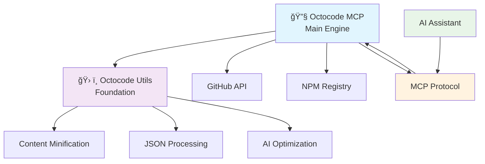

# Octocode Ecosystem

**The Complete AI-Powered Code Analysis and Research Platform**

<div align="center">
  <a href="https://github.com/modelcontextprotocol/servers">
    
    
  </a>
</div>

<div align="center">
  
</div>

<div style="height: 20px;"></div>

<div align="center">
  
  [](https://octocode.ai)
  [](https://x.com/guy_bary)
  [](./LICENSE.md)
  [](https://modelcontextprotocol.io/)
  [](https://buymeacoffee.com/bgauryy)
  
</div>

## 🌟 What is Octocode?

**Octocode** is a revolutionary AI-powered code analysis and research platform that transforms how developers, teams, and organizations understand, explore, and work with codebases. Built on the **Model Context Protocol (MCP)**, Octocode provides AI assistants with unprecedented capabilities to analyze GitHub repositories, search code semantically, and extract actionable insights from millions of open-source and private repositories.

### 🎯 The Vision

In the age of AI-assisted development, the bottleneck isn't writing code—it's understanding existing codebases, discovering proven patterns, and extracting institutional knowledge. Octocode bridges this gap by making any codebase instantly accessible and comprehensible to AI assistants, enabling:

- **🧠 Instant Code Intelligence** - Transform any repository into structured knowledge
- **🔍 Semantic Code Discovery** - Find implementations by describing what you need
- **🏢 Enterprise Knowledge Mining** - Extract patterns and practices from organizational codebases
- **⚡ AI-Native Research** - Purpose-built for modern AI-assisted development workflows

## 🌟 Featured On

### Official MCP Server
[](https://github.com/modelcontextprotocol/servers) **modelcontextprotocol/servers**

### Community Collections
- [](https://github.com/punkpeye/awesome-mcp-servers) **punkpeye/awesome-mcp-servers**
- [](https://github.com/appcypher/awesome-mcp-servers) **appcypher/awesome-mcp-servers**
- [](https://github.com/Puliczek/awesome-mcp-security) **Puliczek/awesome-mcp-security**

### MCP Directories & Tools
- [](https://mcp.so/server/octocode/bgauryy)
- [](https://www.pulsemcp.com/servers/bgauryy-octocode)
- [](https://devtool.io/tool/octocode-mcp)
- [](https://www.mcpserverfinder.com/servers/bgauryy/octocode-mcp)
- [](https://mcp-container.com/en/mcp/137e872e-ef4f-4bdb-a697-d1e628200215)

## 🏗️ The Octocode Ecosystem

The Octocode platform consists of specialized packages, each serving a critical role in the AI-powered code analysis pipeline:

### 📦 Core Packages

<table>
<tr>
<td width="50%">

#### 🔧 [Octocode MCP](./packages/octocode-mcp/) - The Main Engine
**The heart of the Octocode platform** - A comprehensive MCP server that provides AI assistants with 8 specialized tools for GitHub repository analysis, code discovery, and package exploration.

**Key Capabilities:**
- **Advanced Code Search** - Semantic search across millions of repositories
- **Repository Intelligence** - Deep structural analysis and exploration
- **Commit & PR Analysis** - Understanding code evolution and development patterns
- **Package Discovery** - NPM and Python package research with repository connections
- **Enterprise Integration** - Private repository access with organizational intelligence

**Perfect For:** AI assistants that need comprehensive code research capabilities

[**📚 Read the Complete MCP Documentation →**](./packages/octocode-mcp/README.md)

</td>
<td width="50%">

#### 🛠️ [Octocode Utils](./packages/octocode-utils/) - The Foundation
**Shared utilities powering the entire ecosystem** - Essential tools for content processing, AI optimization, and data transformation used across all Octocode packages.

**Core Features:**
- **🧠 AI-Optimized Content Processing** - Transform any content for optimal AI consumption
- **⚡ Advanced Minification** - Multi-strategy compression for 50+ file types
- **🔄 JSON-to-Natural Language** - Convert structured data to human-readable format
- **🛡️ Production Ready** - Comprehensive error handling and fallback mechanisms

**Perfect For:** Developers building MCP applications or AI content processing tools

[**📚 Read the Complete Utils Documentation →**](./packages/octocode-utils/README.md)

</td>
</tr>
</table>

### 🔗 Package Relationships



## 🤖 Understanding MCP (Model Context Protocol)

**Model Context Protocol (MCP)** is a revolutionary standard that enables AI assistants to connect with external tools and data sources securely and efficiently. Think of it as the "API standard" for AI applications.

### Why MCP Matters

Traditional AI assistants are limited to their training data and can't access real-time information or perform actions in external systems. MCP solves this by providing:

- **🔌 Standardized Integration** - Universal protocol for AI-tool communication
- **🛡️ Secure Architecture** - Built-in security and permission management
- **⚡ Real-Time Capabilities** - Access live data and perform actions
- **🔄 Bidirectional Communication** - Tools can provide context and receive commands

### MCP in the Octocode Context

Octocode leverages MCP to transform AI assistants into powerful code researchers:

```
AI Assistant  ←→  MCP Protocol  ←→  Octocode Tools  ←→  GitHub/NPM APIs
     ↑                                    ↓
   Natural                           Structured
   Language                            Data
   Queries                          & Actions
```

**The Flow:**
1. **Developer asks** AI assistant about code patterns or repositories
2. **AI assistant** communicates with Octocode via MCP protocol
3. **Octocode tools** execute advanced searches and analysis
4. **Results flow back** through MCP as structured, AI-optimized data
5. **AI assistant** provides intelligent insights based on real code

## 🚀 Quick Start

### Installation Options

Choose your preferred installation method:

<table>
<tr>
<th>🎯 Main Package (Recommended)</th>
<th>🔧 Individual Packages</th>
</tr>
<tr>
<td>

**For AI-powered code research:**

```bash
# Claude Desktop (recommended)
claude mcp add octocode npx 'octocode-mcp@latest'

# Or via npm
npm install -g octocode-mcp
```

</td>
<td>

**For custom development:**

```bash
# MCP Server
npm install octocode-mcp

# Utilities
npm install octocode-utils
```

</td>
</tr>
</table>

### Authentication Setup

Configure GitHub access for enhanced capabilities:

**Option 1: Environment Variable (Recommended)**
```json
{
  "octocode": {
    "command": "npx",
    "args": ["octocode-mcp"],
    "env": {
      "GITHUB_TOKEN": "your_github_token"
    }
  }
}
```

**Option 2: GitHub CLI (Automatic)**
Using [GitHub CLI](https://cli.github.com/) provides seamless authentication after running `gh auth login`:

```json
{
  "octocode": {
    "command": "npx",
    "args": ["octocode-mcp"]
  }
}
```

### First Research Query

Once installed, try this with your AI assistant:

```
Use Octocode to research React authentication patterns. 
Find the most popular implementations, analyze their approaches, 
and create a comprehensive guide with code examples.
```

## 🎯 Use Cases & Applications

<table>
<tr>
<td width="33%">

### 🏢 Enterprise Teams
**Organizational Intelligence**
- Map coding standards across teams
- Extract institutional knowledge
- Analyze architectural patterns
- Discover internal libraries

**Security & Compliance**
- Scan for vulnerabilities
- Audit compliance
- Analyze access controls
- Track security patterns

</td>
<td width="33%">

### 👨‍💻 Individual Developers
**Learning & Discovery**
- Learn from production codebases
- Discover proven patterns
- Understand complex architectures
- Generate documentation

**Development Acceleration**
- Find existing solutions
- Understand dependencies
- Generate boilerplate code
- Research best practices

</td>
<td width="33%">

### 🔬 Researchers & Analysts
**Code Analysis**
- Large-scale pattern analysis
- Study coding evolution
- Analyze technology adoption
- Research vulnerabilities

**Ecosystem Understanding**
- Map package relationships
- Understand adoption trends
- Analyze project health
- Study collaboration patterns

</td>
</tr>
</table>

## 🌐 Ecosystem Recognition

### Official Recognition

Octocode is featured in major MCP communities and directories:

- **[Official MCP Servers](https://github.com/modelcontextprotocol/servers)** - Core community collection
- **[Awesome MCP Servers](https://github.com/punkpeye/awesome-mcp-servers)** - Community curated list
- **[MCP.so Directory](https://mcp.so/server/octocode/bgauryy)** - Searchable server directory
- **[PulseMCP Registry](https://www.pulsemcp.com/servers/bgauryy-octocode)** - Server registry and analytics


## 🏗️ Architecture & Technical Excellence

For detailed technical architecture, implementation details, and advanced features, see our comprehensive [Technical Architecture Documentation](./packages/octocode-mcp/docs/summary.md).

## 🔮 Future Roadmap

### Planned Enhancements

**New Integrations:**
- **GitLab Support** - Extend beyond GitHub to GitLab repositories
- **Bitbucket Integration** - Complete Git platform coverage
- **Additional Package Registries** - PyPI, RubyGems, Maven, etc.

**Advanced Features:**
- **Code Similarity Analysis** - Find similar implementations across repositories
- **Dependency Graph Analysis** - Understand complex dependency relationships
- **Real-time Monitoring** - Track changes and updates in watched repositories
- **Custom Pattern Detection** - User-defined code pattern recognition

**Enterprise Features:**
- **Advanced Analytics** - Usage patterns and insights
- **Team Collaboration** - Shared research and knowledge bases
- **Custom Deployment Options** - On-premises and air-gapped environments
- **Advanced Security Controls** - Fine-grained access and audit logging

## 📚 Documentation & Resources

### 📖 Package Documentation
- **[🔧 Octocode MCP](./packages/octocode-mcp/README.md)** - Complete MCP server documentation with 8 specialized tools
- **[🛠️ Octocode Utils](./packages/octocode-utils/README.md)** - Utilities and shared components for AI optimization
- **[📊 Technical Architecture](./packages/octocode-mcp/docs/summary.md)** - Deep technical implementation details

### 🌐 External Resources
- **[Official Website](https://octocode.ai)** - Product information and updates
- **[GitHub Repository](https://github.com/bgauryy/octocode-mcp)** - Source code and issues
- **[MCP Documentation](https://modelcontextprotocol.io/)** - Official MCP protocol documentation
- **[Community Discussions](https://github.com/bgauryy/octocode-mcp/discussions)** - User community and support

### 💬 Support & Community
- **[GitHub Issues](https://github.com/bgauryy/octocode-mcp/issues)** - Bug reports and feature requests
- **[X/Twitter](https://x.com/guy_bary)** - Updates and announcements
- **[Email Support](mailto:bgauryy@octocodeai.com)** - Direct developer contact

## 🎉 Join the Revolution

Octocode represents the future of AI-assisted development where artificial intelligence meets human creativity to unlock the full potential of the world's code. Whether you're a solo developer looking to learn from the best, an enterprise team seeking to leverage institutional knowledge, or a researcher analyzing code at scale, Octocode provides the tools and insights you need.

**Start your journey today:**

1. **🚀 Install Octocode MCP** in your AI assistant → [Get Started](./packages/octocode-mcp/README.md)
2. **🔍 Explore the possibilities** with natural language code research
3. **⚡ Transform your workflow** with AI-powered insights
4. **🤝 Join the community** and help shape the future of code intelligence

---

### 🏆 Why Choose Octocode?

<table>
<tr>
<td align="center" width="25%">
<h4>🎯 Purpose-Built</h4>
Designed specifically for AI-assisted code research and analysis
</td>
<td align="center" width="25%">
<h4>🔒 Enterprise-Ready</h4>
Security-first architecture with comprehensive validation and sanitization
</td>
<td align="center" width="25%">
<h4>⚡ High Performance</h4>
Token-optimized responses with intelligent caching and bulk operations
</td>
<td align="center" width="25%">
<h4>🌍 Open Source</h4>
MIT licensed with active community development and support
</td>
</tr>
</table>

---

**Ready to revolutionize your code research?** 

[](./packages/octocode-mcp/README.md) [](./packages/octocode-utils/README.md)

## 📄 License

MIT License - See [LICENSE](./LICENSE.md) for details.

---

<div align="center">
  <strong>Built with ❤️ by the Octocode team</strong><br>
  <em>Transforming code research, one repository at a time</em>
  
  <br><br>
  
  <a href="https://octocode.ai">🌐 Website</a> • 
  <a href="https://x.com/guy_bary">🐦 Twitter</a> • 
  <a href="https://github.com/bgauryy/octocode-mcp">⭐ GitHub</a> • 
  <a href="mailto:bgauryy@octocodeai.com">📧 Contact</a> • 
  <a href="https://buymeacoffee.com/bgauryy">☕ Buy Me a Coffee</a>
</div>
