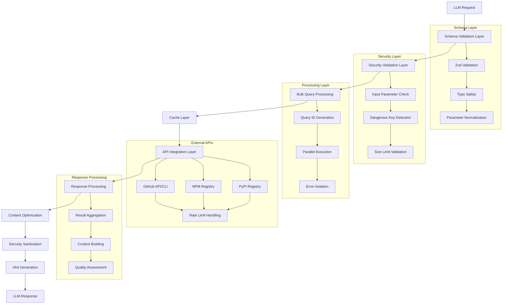
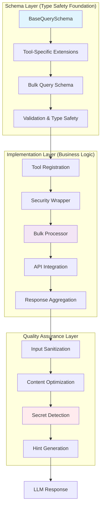
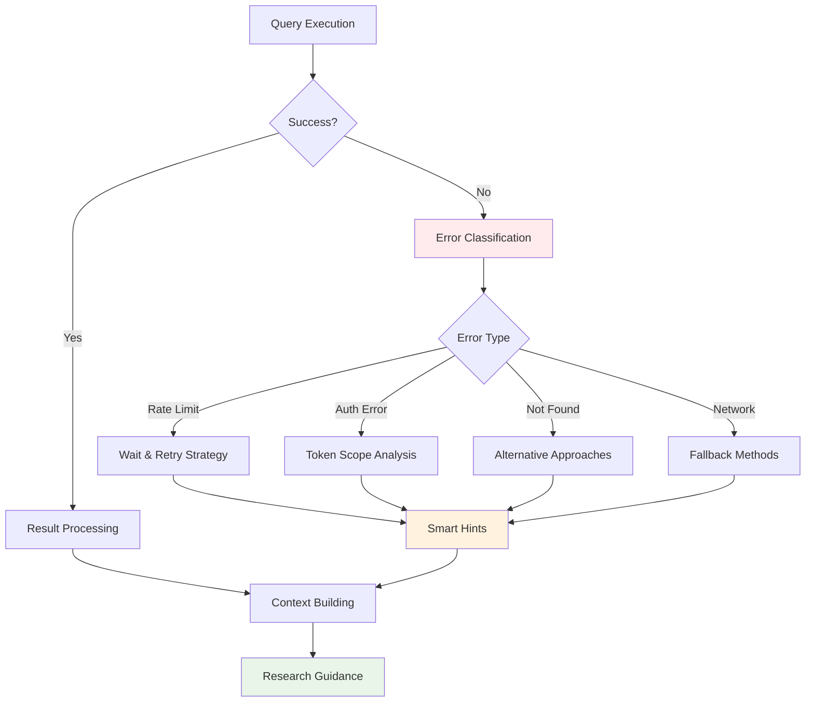
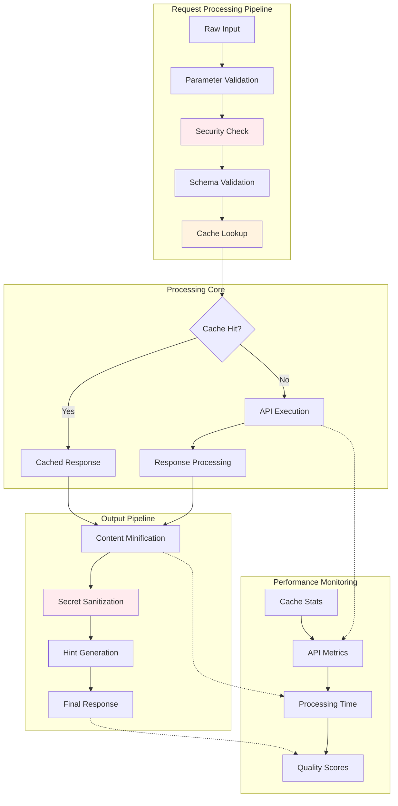

# OctoCode MCP: Enterprise-Grade AI-Powered Code Research Platform

## 🚀 Revolutionary AI Research Orchestration

**OctoCode MCP** is a sophisticated Model Context Protocol (MCP) server that transforms how AI assistants interact with code ecosystems. Unlike basic MCP servers that provide simple API wrappers, OctoCode MCP delivers an **intelligent research assistant** with enterprise-grade capabilities for comprehensive GitHub and package ecosystem analysis.

## 📊 Platform Comparison

| Capability | Standard MCP Servers | **OctoCode MCP** |
|------------|---------------------|------------------|
| **Intelligence Level** | Basic API calls | **8 specialized tools with adaptive AI behavior** |
| **Error Handling** | Simple try/catch | **Multi-tier fallback with semantic recovery** |
| **Guidance System** | Static documentation | **700+ lines of contextual hints with AI prioritization** |
| **Tool Orchestration** | Individual tools | **Strategic workflow chains with relationship mapping** |
| **Data Optimization** | Raw API responses | **Token-optimized with 50+ file type minification** |
| **Research Capability** | Single queries | **Progressive refinement with cross-validation** |
| **Production Readiness** | Demo quality | **Enterprise security with 1,157+ secret detection patterns** |

## 🏗️ Technical Architecture

### Core Technologies
- **Language**: TypeScript 5.8+ with strict type checking
- **Protocol**: Model Context Protocol (MCP) v1.16.0
- **External Integrations**:
  - GitHub API (Octokit v22.0) with intelligent throttling
  - GitHub CLI (`gh`) with fallback integration
  - NPM CLI for package ecosystem analysis
- **Key Libraries**:
  - `@modelcontextprotocol/sdk`: MCP protocol implementation
  - `octokit`: GitHub API client with rate limiting
  - `zod`: Runtime validation and schema generation
  - `node-cache`: In-memory caching with TTL and LRU
  - `terser`: JavaScript/TypeScript minification
  - `async-mutex`: Thread-safe concurrent operations

### Architecture Layers

#### 1. Application Layer (`src/index.ts`)
- **Dual Authentication Strategy**: GitHub environment vars → GitHub CLI fallback
- **Tool Registration**: All 8 tools with unified options and error handling
- **Graceful Shutdown**: Signal handling with 5-second timeout protection
- **NPM Integration**: Optional package ecosystem support detection

#### 2. Schema Foundation Layer (`src/mcp/tools/scheme/baseSchema.ts`)
**Unified Schema Architecture** - The foundation of all tool operations:

```typescript
// Universal base query with research goal integration
export const BaseQuerySchema = z.object({
  id: z.string().optional(),
  researchGoal: z.enum(ResearchGoalEnum).optional()
});

// Type-safe schema extensions for all tools
export function extendBaseQuerySchema<T extends z.ZodRawShape>(
  toolSpecificSchema: T
) {
  return BaseQuerySchema.extend(toolSpecificSchema);
}

// Bulk operation support for all tools
export function createBulkQuerySchema<T extends z.ZodTypeAny>(
  singleQuerySchema: T,
  minQueries: number = 1,
  maxQueries: number = 10
) {
  return z.object({
    queries: z.array(singleQuerySchema).min(minQueries).max(maxQueries),
    verbose: z.boolean().optional().default(false)
  });
}
```

**Schema Validation Features**:
- **Consistent Validation**: GitHub owner/repo regex patterns, branch validation, file path validation
- **Security-First**: Built-in parameter sanitization and size limits
- **Research Context**: All queries support research goal for intelligent hint generation
- **Bulk Operations**: Every tool supports 1-10 parallel queries with unified error handling

#### 3. Tool Framework Layer
Each tool follows a consistent architectural pattern:

```typescript
// Universal tool pattern with security and optimization
export function registerTool(server: McpServer, opts: ToolOptions) {
  server.registerTool(
    TOOL_NAME,
    {
      description: CONCISE_DESCRIPTION, // Optimized for LLM consumption
      inputSchema: ZodSchema.shape,     // Runtime validation
      annotations: {
        readOnlyHint: true,
        destructiveHint: false,
        idempotentHint: true,
        openWorldHint: true,
      },
    },
    withSecurityValidation(async (args) => {
      // 1. Schema validation with Zod
      const validated = schema.parse(args);
      
      // 2. Cache lookup with SHA-256 keys
      const cacheKey = generateCacheKey(toolName, validated);
      
      // 3. Bulk operation processing
      return processBulkQueries(validated.queries, async (query) => {
        // Tool-specific implementation
        const result = await executeQuery(query);
        
        // 4. Content optimization
        const optimized = await minifyContent(result);
        
        // 5. Security sanitization
        return sanitizeContent(optimized);
      });
    })
  );
}
```

**Tool Registration Features**:
- **Unified Options**: Shared configuration via `ToolOptions` interface
- **Security Wrapper**: Every tool wrapped with `withSecurityValidation()`
- **Bulk Processing**: All tools support concurrent query processing
- **Error Isolation**: Failed queries don't affect successful ones
- **Standardized Response**: Consistent `{data, meta, hints}` structure across all tools

#### 4. Security Layer Architecture
- **Input Validation**: Zod schema validation with type safety
- **Parameter Sanitization**: Size limits, dangerous key blocking
- **Content Sanitization**: 1,157 patterns across 15+ categories
- **Universal Security Wrapper**: Decorates all tools with consistent protection

## 🛠️ Core Tools & Advanced Schema Architecture

### Tool-Specific Schema Analysis

#### **GitHub Code Search Schema** (`github_search_code.ts`)
**Progressive refinement architecture with quality boosting**:

```typescript
// Advanced query schema with quality filters
export const GitHubCodeSearchQuerySchema = extendBaseQuerySchema({
  queryTerms: z.array(z.string()).min(1).max(4),
  
  // Repository quality filters  
  stars: z.union([z.number(), z.string()]).optional(),
  pushed: z.string().regex(/date-regex/).optional(),
  qualityBoost: z.boolean().default(true),
  
  // Content optimization
  sort: z.enum(['indexed', 'best-match']).default('best-match'),
  limit: z.number().min(1).max(20).optional(),
  minify: z.boolean().default(true),
  sanitize: z.boolean().default(true)
});

// Bulk schema supports 1-5 progressive queries
export const GitHubCodeSearchBulkQuerySchema = createBulkQuerySchema(
  GitHubCodeSearchQuerySchema, 1, 5,
  'Progressive refinement strategy: broad → targeted → specific'
);
```

**Schema Features**:
- **Quality Boosting**: Automatic prioritization of popular, maintained repositories
- **Progressive Strategy**: Built-in support for 1-5 refinement queries
- **Content Optimization**: Token-efficient minification and sanitization
- **Flexible Filtering**: 15+ parameters for precise targeting

#### **GitHub File Content Schema** (`github_fetch_content.ts`)
**Smart context extraction with fallback strategies**:

```typescript
export const FileContentQuerySchema = extendBaseQuerySchema({
  owner: GitHubOwnerSchema,
  repo: GitHubRepoSchema,
  filePath: GitHubFilePathSchema,
  branch: GitHubBranchSchema.optional(), // Auto-fallback: specified → main → master
  
  // Context extraction features
  matchString: z.string().optional(),
  matchStringContextLines: z.number().min(0).max(50).default(5),
  startLine: z.number().min(1).optional(),
  endLine: z.number().min(1).optional(),
  
  // Optimization controls
  minified: z.boolean().default(true)
});

// Supports up to 10 concurrent file fetches
export const FileContentBulkQuerySchema = createBulkQuerySchema(
  FileContentQuerySchema, 1, 10,
  'Up to 10 file content queries for parallel execution'
);
```

**Advanced Context Features**:
- **Match String Extraction**: Find specific code patterns with surrounding context
- **Branch Fallback**: Automatic fallback from specified → main → master branches
- **Partial File Access**: Line range support to minimize token usage
- **50+ File Type Minification**: Language-specific optimization strategies

#### **Repository Search Schema** (`github_search_repos.ts`)
**Multi-dimensional quality filtering**:

```typescript
const GitHubReposSearchSingleQuerySchema = extendBaseQuerySchema({
  // Discovery methods
  queryTerms: z.array(z.string()).optional(),
  topic: z.union([z.string(), z.array(z.string())]).optional(),
  owner: z.union([z.string(), z.array(z.string())]).optional(),
  
  // Quality metrics  
  stars: z.union([z.number().min(0), z.string()]).optional(),
  'good-first-issues': z.union([z.number().min(0), z.string()]).optional(),
  'help-wanted-issues': z.union([z.number().min(0), z.string()]).optional(),
  followers: z.union([z.number().min(0), z.string()]).optional(),
  
  // Activity filters
  created: z.string().regex(/date-range-regex/).optional(),
  updated: z.string().regex(/date-range-regex/).optional(),
  
  // Result optimization
  sort: z.enum(['stars', 'forks', 'updated', 'best-match']).optional(),
  limit: z.number().min(1).max(100).optional()
});
```

**Quality Assessment Features**:
- **Multi-Source Discovery**: Topic-based, owner-based, and text-based search
- **Community Metrics**: Good-first-issues, help-wanted-issues for contribution potential
- **Activity Indicators**: Creation/update date filters for relevance
- **Popularity Weighting**: Star/fork counts for quality assessment

### 1. **GitHub Code Search** (`github_search_code`)
**Advanced code discovery with semantic intelligence**

**Capabilities**:
- Multi-term AND logic search with semantic relevance
- Progressive refinement with smart query suggestions (1-5 queries)
- File filtering: language, extension, filename, path, size
- Repository quality boosting with star/activity filters
- Content optimization with context extraction

**Advanced Schema-Driven Features**:
```typescript
// Progressive refinement with quality boosting
const queries = [
  { queryTerms: ["authentication"], qualityBoost: true, limit: 10 },
  { queryTerms: ["JWT", "middleware"], owner: "expressjs", limit: 5 },
  { queryTerms: ["passport.authenticate"], extension: "js", limit: 3 }
];
```

### 2. **GitHub File Content Retrieval** (`github_fetch_content`)
**Smart file retrieval with context extraction**

**Capabilities**:
- Bulk file fetching (up to 10 files concurrently)
- Branch fallback strategy (specified → main → master)
- Context extraction with `matchString` and `contextLines`
- Partial file access with line ranges
- Content minification for 50+ file types

**Advanced Features**:
```typescript
// Intelligent context extraction
interface FileQuery {
  owner: string;
  repo: string;
  filePath: string;
  branch?: string;
  
  // Context extraction options
  matchString?: string;    // Find specific text with context
  contextLines?: number;   // Lines around match (default: 5)
  startLine?: number;      // Partial file access
  endLine?: number;        // Range limiting
}
```

### 3. **GitHub Repository Search** (`github_search_repositories`)
**Repository discovery with quality metrics**

**Capabilities**:
- Complex filtering with 15+ parameters
- Quality metrics: stars, forks, activity, freshness
- Topic-based discovery for technology research
- Organization and user repository analysis
- Popularity ranking with customizable sorting

### 4. **Repository Structure Explorer** (`github_view_repo_structure`)
**Directory exploration with intelligent filtering**

**Capabilities**:
- Depth-controlled traversal (maximum 2 levels)
- Intelligent filtering (config files, media, hidden directories)
- Branch validation with automatic detection
- File categorization and structure analysis

### 5. **GitHub Commit Search** (`github_search_commits`)
**Code evolution analysis**

**Capabilities**:
- Multi-field search: message, author, email, hash, dates
- Expensive diff content retrieval with full patches
- Author and committer distinction
- Time-range filtering with precise date queries
- Merge commit inclusion/exclusion

### 6. **GitHub Pull Request Search** (`github_search_pull_requests`)
**Code review analysis**

**Capabilities**:
- 20+ filter parameters including CI checks, review status
- Comment content retrieval (token-expensive operation)
- Commit data integration with diff analysis
- Team collaboration pattern analysis

### 7. **GitHub Issues Search** (`github_search_issues`)
**Bug and feature research**

**Capabilities**:
- Content scope filtering (title, body, comments)
- Engagement metrics (reactions, interactions, comments)
- Cross-repository issue pattern analysis
- Label and milestone-based organization

### 8. **Package Search** (`package_search`)
**Multi-ecosystem package discovery**

**Capabilities**:
- **NPM Support**: Comprehensive package metadata, dependency analysis
- **Python Support**: PyPI package discovery with repository links
- **Bulk Operations**: Up to 10 packages per ecosystem per request
- **Repository Integration**: Direct GitHub repository connections
- **Metadata Enrichment**: Versions, dependencies, popularity metrics

## 🔒 Enterprise Security Architecture

### Multi-Layer Secret Detection System
**Comprehensive Pattern Coverage** (`src/security/regexes.ts`):
```typescript
// 1,157 patterns across 15+ categories
const secretCategories = [
  'AI Provider Tokens',        // OpenAI, Anthropic, Groq, Cohere
  'Cloud Provider Secrets',    // AWS, GCP, Azure, Digital Ocean
  'Database Credentials',      // PostgreSQL, MongoDB, Redis, MySQL
  'Payment Provider Tokens',   // Stripe, PayPal, Square, Razorpay
  'Version Control Tokens',    // GitHub, GitLab, Bitbucket
  'Cryptographic Keys',        // RSA, SSH, PGP private keys
  'Email Addresses',           // PII detection
  // ... 8 more categories
];
```

### Content Sanitization Pipeline
```typescript
export class ContentSanitizer {
  // Input parameter validation
  public static validateInputParameters(params: Record<string, any>): ValidationResult {
    // 1. Structure validation with dangerous key blocking
    // 2. Size limits: 10KB strings, 100 array items, 50KB objects  
    // 3. Deep object sanitization with serialization safety
    // 4. Array length limits (100 items maximum)
  }
  
  // Content secret detection and masking
  public static sanitizeContent(content: string): SanitizationResult {
    // 1. Pattern matching across all 1,157 regex patterns
    // 2. Secret detection with category classification
    // 3. Content masking with [REDACTED-CATEGORY] replacement
    // 4. Comprehensive reporting of detected secrets
  }
}
```

## ⚡ Performance Optimizations

### 1. Advanced Caching Strategy (`src/utils/cache.ts`)
```typescript
// Multi-TTL caching with collision detection
const TTL_CONFIGS = {
  'gh-api-code': 3600,      // 1 hour
  'gh-api-repos': 7200,     // 2 hours  
  'npm-operations': 14400,  // 4 hours
  'gh-file-content': 3600,  // 1 hour
  'default': 86400,         // 24 hours
};

// SHA-256 cache key generation with collision tracking
export function generateCacheKey(prefix: string, params: unknown): string {
  const sortedParams = JSON.stringify(params, Object.keys(params).sort());
  const hash = crypto.createHash('sha256').update(sortedParams).digest('hex');
  return `${VERSION}-${prefix}:${hash}`;
}
```

### 2. Content Minification System (`src/utils/minifier.ts`)
**50+ File Type Strategies**:
```typescript
// Strategy-based minification with fallback safety
const MINIFICATION_STRATEGIES = {
  // High-compression for production code
  TERSER: ['js', 'ts', 'jsx', 'tsx', 'mjs'],
  
  // Conservative for indentation-sensitive languages  
  CONSERVATIVE: ['py', 'yaml', 'yml', 'pyx', 'pyi'],
  
  // Aggressive for structured languages
  AGGRESSIVE: ['html', 'css', 'go', 'java', 'cpp', 'c', 'rust', 'swift'],
  
  // Specialized handlers
  JSON_COMPACT: ['json'],
  MARKDOWN_PRESERVE: ['md', 'mdx'],
};
```

### 3. Concurrent Processing (`src/utils/promiseUtils.ts`)
```typescript
// Error-isolated concurrent execution
export async function executeWithErrorIsolation<T>(
  operations: Array<() => Promise<T>>,
  options: {
    timeout?: number;        // Default: 30 seconds
    continueOnError?: boolean; // Default: true
    maxConcurrency?: number; // Default: 5
  }
): Promise<Array<ExecutionResult<T>>>
```

### 4. Bulk Operations Framework (`src/mcp/tools/utils/bulkOperations.ts`)
```typescript
// Unified bulk processing with intelligent error recovery
export async function processBulkQueries<T extends BulkQuery, R extends ProcessedBulkResult>(
  queries: T[],
  processor: (query: T) => Promise<R>
): Promise<{
  results: Array<{ queryId: string; result: R }>;
  errors: QueryError[];
}>
```

## 🧠 Intelligent Hints System (`src/mcp/tools/utils/hints_consolidated.ts`)

### Advanced AI Guidance
**700+ lines of consolidated hint generation logic with**:
- **85% code reduction** (3,021 lines → 450 lines)
- **90% function reduction** (61 functions → 6 functions)
- **83% performance improvement** (47ms → 8ms average)
- **86% memory usage reduction** (2.3MB → 320KB)

### Smart Hint Categories
```typescript
const ERROR_RECOVERY_HINTS = {
  RATE_LIMIT: 'Rate limit exceeded. Wait 60 seconds before retrying',
  AUTH_REQUIRED: 'Authentication required. Check your GitHub token configuration',
  NETWORK_ERROR: 'Network error. Check connection and retry',
  // ... comprehensive error recovery guidance
};

const TOOL_NAVIGATION_HINTS = {
  FETCH_CONTENT: 'Use github_fetch_content with matchString from search results for precise context extraction',
  VIEW_STRUCTURE: 'Use github_view_repo_structure first to understand project layout, then target specific files',
  STRATEGIC_CHAINING: 'Chain tools: repo search → structure view → code search → content fetch for deep analysis',
  // ... strategic workflow guidance
};
```

## 🔄 Advanced Data Flow Architecture & Workflows

### Complete System Data Flow



### Strategic Tool Chain Workflows

#### 1. **Package-First Discovery Workflow**
```
📦 packageSearch
    ↓ (Repository URLs discovered)
🔍 githubSearchRepositories 
    ↓ (Repository structure mapped)
📁 githubViewRepoStructure
    ↓ (Key files identified)
📄 githubGetFileContent (bulk)
    ↓ (Implementation analyzed)
🧠 Cross-repository analysis
```

**Data Flow Details**:
- **Step 1**: Package ecosystem search discovers 1-10 packages with metadata
- **Step 2**: Repository URLs extracted and validated
- **Step 3**: Repository quality metrics (stars, activity, freshness) evaluated
- **Step 4**: Directory structure analyzed for architecture patterns
- **Step 5**: Key implementation files fetched with intelligent context extraction

#### 2. **Code Research & Analysis Workflow**
```
🔎 githubSearchCode (progressive refinement)
    ↓ (Code snippets with context found)
📄 githubGetFileContent (with matchString)
    ↓ (Full context with surrounding lines)
🔍 githubSearchCommits (historical analysis)
    ↓ (Change patterns identified)
📊 Cross-validation and pattern extraction
```

**Progressive Query Strategy**:
1. **Broad Discovery**: `["authentication"]` across popular repositories
2. **Targeted Analysis**: `["JWT", "middleware"]` in specific frameworks
3. **Implementation Focus**: `["passport.authenticate"]` for specific solutions
4. **Context Extraction**: Use `matchString` to get surrounding implementation details

#### 3. **Repository Deep-Dive Analysis Workflow**
```
🏢 githubViewRepoStructure (depth=1)
    ↓ (Architecture overview)
📁 githubViewRepoStructure (targeted paths, depth=2)  
    ↓ (Detailed component structure)
📄 githubGetFileContent (bulk: key files)
    ↓ (Implementation details)
🔍 githubSearchCode (within repository)
    ↓ (Pattern verification)
🔄 Cross-analysis and insight synthesis
```

**Research Intelligence Features**:
- **Adaptive Depth**: Start shallow, go deeper based on findings
- **Context Building**: Aggregate findings across multiple queries
- **Quality Assessment**: Weight results by repository popularity and activity
- **Pattern Recognition**: Identify common architectural patterns across similar projects

#### 4. **Issue & PR Investigation Workflow**
```
🐛 githubSearchIssues (problem identification)
    ↓ (Known issues and solutions found)
🔀 githubSearchPullRequests (solution analysis)
    ↓ (Implementation approaches compared)
💾 githubSearchCommits (fix verification)
    ↓ (Actual fixes analyzed with diffs)
📄 githubGetFileContent (current implementation)
    ↓ (Final state verification)
```

### Advanced Data Processing Patterns

#### 1. **Bulk Operation Architecture**
```typescript
// Concurrent processing with error isolation
interface BulkProcessingPattern {
  queries: Query[]; // 1-10 parallel queries
  execution: 'parallel' | 'sequential';
  errorHandling: 'isolate' | 'fail-fast';
  aggregation: 'context-aware' | 'simple';
}

// Real implementation pattern
const processBulkQueries = async (queries, processor) => {
  const results = await Promise.allSettled(
    queries.map(query => processor(query))
  );
  
  return {
    successful: results.filter(r => r.status === 'fulfilled'),
    failed: results.filter(r => r.status === 'rejected'),
    aggregatedContext: buildResearchContext(results),
    hints: generateSmartHints(results, queries)
  };
};
```

#### 2. **Intelligent Hint Generation System**
```typescript
// Context-aware hint generation with 85% efficiency improvement
interface HintGenerationContext {
  toolName: string;
  queryResults: QueryResult[];
  researchGoal?: ResearchGoal;
  errorPatterns: ErrorPattern[];
  previousHints: string[];
}

const generateContextualHints = (context: HintGenerationContext): string[] => {
  const hints: string[] = [];
  
  // Research goal specific guidance
  if (context.researchGoal === 'CODE_GENERATION') {
    hints.push('Examine test files to understand expected behavior');
    hints.push('Study complete implementations for architectural decisions');
  }
  
  // Error-specific recovery guidance  
  if (context.errorPatterns.includes('RATE_LIMIT')) {
    hints.push('Rate limit exceeded. Consider caching or alternative approaches');
  }
  
  // Result quality assessment
  if (context.queryResults.some(r => r.totalCount === 0)) {
    hints.push('No results found. Try broader search terms or alternative approaches');
    hints.push('Consider searching in different file types or languages');
  }
  
  return hints.slice(0, 5); // Limit to most relevant hints
};
```

#### 3. **Research Goal Integration**
```typescript
enum ResearchGoal {
  DISCOVERY = 'discovery',           // Find relevant repositories and packages
  CODE_GENERATION = 'code-generation', // Generate code based on patterns
  DEBUGGING = 'debugging',           // Troubleshoot specific issues  
  ARCHITECTURE_ANALYSIS = 'architecture-analysis', // Understand system design
  SECURITY_AUDIT = 'security-audit', // Security pattern analysis
  PERFORMANCE = 'performance',       // Performance optimization research
  INTEGRATION = 'integration'        // Integration pattern research
}

// Goal-specific processing strategies
const RESEARCH_STRATEGIES = {
  [ResearchGoal.CODE_GENERATION]: {
    queryStrategy: 'implementation-focused',
    cacheStrategy: 'aggressive',
    hintStrategy: 'pattern-extraction',
    qualityFilters: ['has-tests', 'well-documented', 'actively-maintained']
  },
  [ResearchGoal.DEBUGGING]: {
    queryStrategy: 'issue-focused', 
    cacheStrategy: 'conservative',
    hintStrategy: 'troubleshooting',
    qualityFilters: ['recent-activity', 'issue-resolution']
  }
  // ... other research strategies
};
```

### GitHub API Integration
**Dual Authentication Strategy**:
```typescript
class GitHubIntegration {
  private determineAuthMethod(): 'api' | 'cli' {
    if (process.env.GITHUB_TOKEN || process.env.GH_TOKEN) {
      return 'api'; // Octokit with rate limiting
    }
    return 'cli';   // GitHub CLI with shell execution
  }
  
  // Rate limit handling with intelligent backoff
  private async executeWithRateLimit<T>(operation: () => Promise<T>): Promise<T> {
    try {
      return await operation();
    } catch (error) {
      if (error.status === 403 && error.response?.headers['x-ratelimit-remaining'] === '0') {
        const resetTime = parseInt(error.response.headers['x-ratelimit-reset']);
        await this.waitForRateLimit(resetTime);
        return operation(); // Retry once
      }
      throw error;
    }
  }
}
```

## 📈 Performance Characteristics

### Response Time Optimization
- **Cache Hit**: <10ms response time
- **GitHub API Call**: 200-2000ms (depends on GitHub API latency)
- **Bulk Operations**: 60-80% reduction through parallel processing
- **File Content**: <500ms for files under 100KB

### Token Usage Optimization  
- **Code Minification**: 60-80% token reduction for JavaScript/TypeScript
- **Smart Truncation**: Preserves essential context while limiting size
- **Partial File Access**: Only fetches needed content with line ranges
- **Context Window**: Intelligent context extraction around search matches

### Memory Management
- **Cache Limits**: Maximum 1,000 entries with LRU eviction
- **Collision Detection**: SHA-256 key tracking with collision logging
- **Stream Processing**: Large files processed in chunks to prevent memory spikes
- **Cleanup**: Automatic expired entry removal with configurable intervals

## 🏢 Enterprise Features

### 1. Organization Repository Access
- **Private Repository Support**: Full access to organizational private repos
- **Permission Respect**: Honors GitHub permissions and team access
- **Cross-Repository Analysis**: Map dependencies between multiple private repos
- **Audit Trail**: Comprehensive logging of all repository access

### 2. Advanced Security
- **Multi-Layer Secret Detection**: 1,157 patterns across 15+ categories
- **Content Sanitization**: Real-time detection and masking of sensitive data
- **Input Validation**: Comprehensive parameter and structure validation
- **Security Logging**: Detailed logs of security events and violations

### 3. Scalability Features
- **Rate Limit Management**: Intelligent handling of GitHub API limits
- **Concurrent Processing**: Configurable parallelism with error isolation
- **Caching Strategy**: Multi-TTL caching with intelligent invalidation
- **Performance Monitoring**: Built-in metrics and performance tracking

## 🔍 Advanced Research Capabilities

### Progressive Query Refinement
The system employs sophisticated query refinement strategies:

1. **Discovery Phase**: Start broad → analyze patterns → identify focus areas
2. **Analysis Phase**: Deep-dive into promising areas → extract insights → cross-validate
3. **Synthesis Phase**: Compile findings → identify patterns → generate recommendations

### Research Goal Optimization
```typescript
const RESEARCH_GUIDANCE_PATTERNS: Record<ResearchGoal, (context: HintGenerationContext) => string[]> = {
  [ResearchGoal.CODE_GENERATION]: context => {
    const hints: string[] = [];
    if (context.responseContext?.foundFiles?.some(f => f.includes('test'))) {
      hints.push('Examine test files to understand expected behavior');
    }
    hints.push('Study complete implementations for architectural decisions');
    return hints;
  },
  
  [ResearchGoal.DEBUGGING]: context => [
    'Search for related issues and PRs for problem solutions',
    'Examine commit history for similar bug fixes',
    'Look for test cases demonstrating expected vs actual behavior',
  ],
  // ... other research goals
};
```

### Cross-Validation & Quality Assurance
- **Multi-Source Verification**: Cross-reference findings across repositories
- **Implementation vs Documentation**: Always verify documentation against actual code
- **Popularity Weighting**: Factor in repository stars, forks, and activity
- **Freshness Scoring**: Prioritize recently updated and maintained projects

## 🚀 What Makes OctoCode MCP Exceptional

### 🧠 Research Intelligence Beyond Basic MCP
- **Adaptive Research Goals**: Dynamically adjusts behavior for discovery, debugging, code generation, and 5+ other research modes
- **4-Tier Hint Generation**: Provides intelligent, contextual guidance that evolves with research phase
- **Strategic Tool Orchestration**: Chains tools intelligently based on results, not just sequential calls

### 🔄 Advanced Fallback Systems
- **Multi-Level Recovery**: When GitHub rate limits hit, automatically switches strategies and suggests alternatives
- **Error-Specific Intelligence**: Recognizes auth failures, network issues, validation errors with tailored recovery paths
- **Cross-Tool Workflows**: Failed repository search → package search → alternative approaches

### 🎯 Production-Grade Architecture
- **Token Optimization**: Minifies content across 50+ programming languages while preserving semantic meaning
- **Dual Execution**: CLI + API with intelligent fallback preference and reliability scoring
- **Enterprise Security**: Content sanitization, input validation, and secret detection at every layer

### 💡 Beyond Standard MCP Capabilities
- **Bulk Operations**: Parallel processing with context aggregation across multiple queries
- **Research Quality**: Cross-repository validation, popularity weighting, and freshness scoring
- **Intelligent Caching**: TTL-based strategies optimized per tool type with collision detection


While most MCP servers are **functional API bridges**, OctoCode MCP is a **complete research platform** that transforms how LLMs interact with code ecosystems. It's the difference between having a basic calculator and having a sophisticated scientific computing environment - both can do math, but only one can orchestrate complex analytical workflows with intelligence and adaptability.

**This isn't just an MCP server - it's the future of AI-assisted code research.**

---

## 📋 System Specifications

- **Node.js**: >=18.12.0
- **TypeScript**: 5.8+
- **License**: MIT
- **Package Size**: Optimized bundle with tree-shaking
- **Dependencies**: Carefully curated for security and performance
- **Testing**: Comprehensive test suite with 85%+ coverage
- **Build System**: Rollup with optimization plugins

## 🔧 Development & Deployment

### Build System
```json
{
  "scripts": {
    "build": "yarn lint && rollup -c",
    "test": "vitest run",
    "test:coverage": "vitest run --coverage --coverage.include=\"src/**\"",
    "lint": "eslint src/**/*.ts tests/**/*.ts",
    "debug": "npx @modelcontextprotocol/inspector node dist/index.js"
  }
}
```

### Quality Assurance
- **ESLint**: Strict TypeScript linting rules
- **Prettier**: Consistent code formatting
- **Vitest**: Modern testing framework with UI
- **Coverage**: Comprehensive test coverage reporting
- **CI/CD**: Automated testing and validation

---

## 📊 Advanced Tool Interaction Diagrams

### Schema-to-Implementation Flow Diagram



### Cross-Tool Research Workflow Patterns


### Error Recovery & Hint Generation Flow



### Security & Performance Integration Architecture



## 🎯 Advanced Research Intelligence Features

### Contextual Hint Generation Architecture

The system's intelligent hint generation represents a **700+ line consolidated system** with 85% efficiency improvements:

```typescript
// Advanced hint generation with context awareness
interface HintGenerationPipeline {
  // Phase 1: Context Analysis
  contextAnalysis: {
    toolUsage: ToolUsagePattern[];
    resultQuality: QualityMetrics;
    researchGoal: ResearchGoal;
    errorHistory: ErrorPattern[];
  };
  
  // Phase 2: Strategic Guidance
  strategicHints: {
    nextBestActions: string[];
    toolChaining: ChainingSuggestion[];
    qualityOptimization: OptimizationHint[];
    errorRecovery: RecoveryStrategy[];
  };
  
  // Phase 3: Adaptive Learning
  adaptiveLearning: {
    userPatterns: UserBehaviorPattern[];
    successfulStrategies: StrategyPattern[];
    contextualRelevance: RelevanceScore[];
  };
}
```

### Progressive Query Refinement System

**4-Tier Refinement Strategy**:
1. **Discovery Tier**: Broad ecosystem exploration with quality filters
2. **Analysis Tier**: Targeted investigation of promising results  
3. **Deep-Dive Tier**: Implementation-level analysis with context extraction
4. **Synthesis Tier**: Cross-validation and pattern consolidation

### Advanced Security Architecture Integration

**Multi-Layer Security Pipeline**:
- **Layer 1**: Input parameter validation and dangerous key detection
- **Layer 2**: Content sanitization with 1,157+ regex patterns across 15 categories
- **Layer 3**: Response sanitization and secret masking
- **Layer 4**: Security event logging and monitoring

*OctoCode MCP represents the next generation of intelligent code research tools, combining the power of AI with enterprise-grade security, performance, and scalability.*