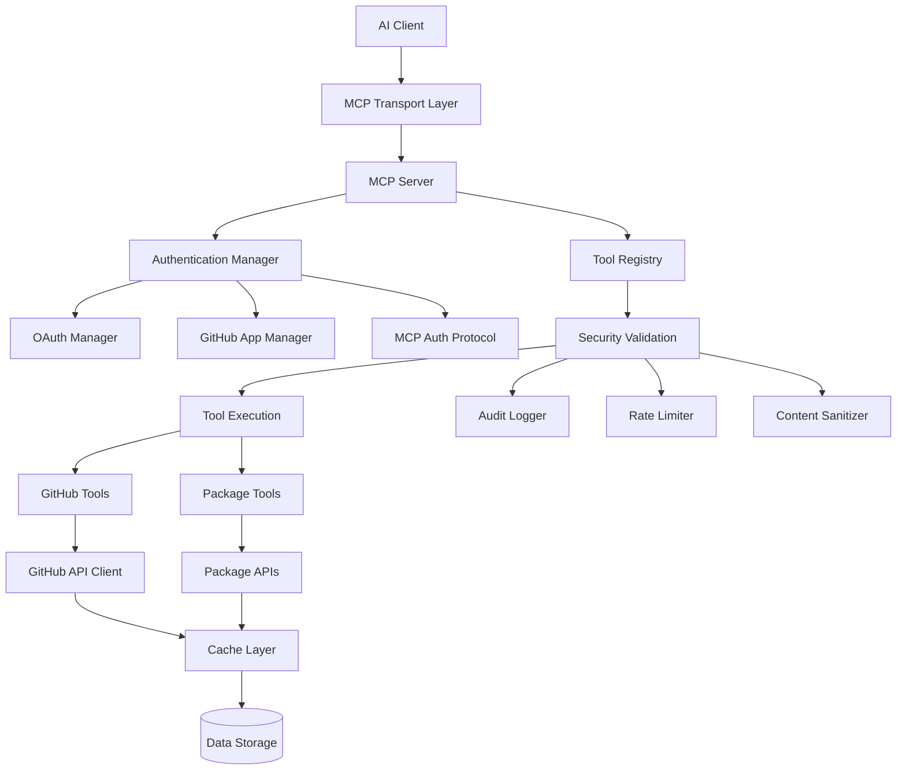
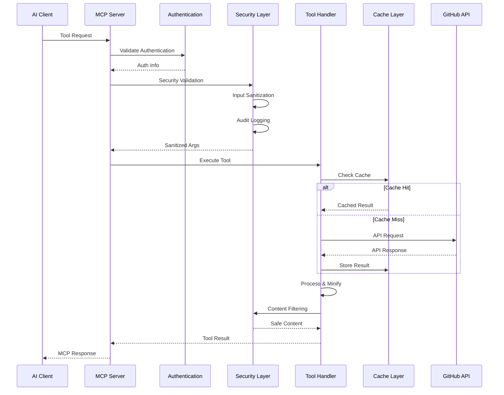
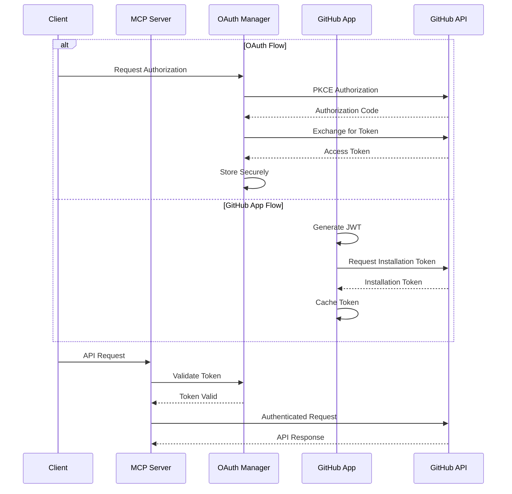

# Octocode-MCP Architecture Summary

**Octocode-MCP** is a Model Context Protocol (MCP) server that provides AI assistants with advanced GitHub repository analysis, code discovery, and package exploration capabilities. This document provides a comprehensive overview of the system architecture.

## Table of Contents

- [System Overview](#system-overview)
- [Core Architecture](#core-architecture)
- [Component Details](#component-details)
  - [Entry Point & Server](#entry-point--server)
  - [Authentication System](#authentication-system)
  - [Configuration Management](#configuration-management)
  - [MCP Tools](#mcp-tools)
  - [Security Layer](#security-layer)
  - [GitHub API Integration](#github-api-integration)
  - [Caching System](#caching-system)
  - [Utility Services](#utility-services)
- [Data Flow](#data-flow)
- [Security Architecture](#security-architecture)
- [Performance & Scalability](#performance--scalability)
- [Tool Ecosystem](#tool-ecosystem)

## System Overview

Octocode-MCP is built on five core engineering pillars:

1. **🔒 Security First**: Input validation, secret detection, content sanitization
2. **⚡ High Performance**: Intelligent caching, smart minification, parallel operations
3. **🛡️ Reliability**: Multi-layer error handling, smart fallbacks, graceful degradation
4. **✨ Code Quality**: TypeScript + Zod validation, comprehensive testing, coding standards
5. **🔧 Maintainability**: Modular design, clean abstractions, consistent patterns

## Core Architecture



## Component Details

### Entry Point & Server

**Location**: `src/index.ts`, `src/server.ts`

The system supports two deployment modes:

1. **Standalone MCP Server** (`index.ts`): Standard MCP protocol over stdio
2. **HTTP Server** (`server.ts`): Express.js server with HTTP endpoints (Beta)

**Key Features**:
- Graceful shutdown handling with cleanup timeout
- Enterprise component initialization
- Tool registration and capability management
- Beta feature toggling (sampling, HTTP server)

### Authentication System

**Location**: `src/auth/`

Unified authentication supporting multiple methods:

#### AuthenticationManager (`authenticationManager.ts`)
- **Purpose**: Single entry point for all authentication initialization
- **Pattern**: Singleton with dependency-ordered initialization
- **Components**: OAuth → GitHub App → Token Management

#### OAuth Manager (`oauthManager.ts`)
- **Standard**: RFC 6749 OAuth 2.0/2.1 compliance
- **Security**: RFC 7636 PKCE support, secure state validation
- **Features**: Automatic token refresh, timing-safe comparison

#### GitHub App Manager (`githubAppManager.ts`)
- **JWT Generation**: RFC 7519 compliant with RS256 signing
- **Token Management**: Installation token caching with auto-expiration
- **Permissions**: Fine-grained validation and repository access control

#### MCP Auth Protocol (`mcpAuthProtocol.ts`)
- **Standard**: Model Context Protocol Authorization specification
- **Features**: Bearer token authentication, WWW-Authenticate headers
- **Discovery**: OAuth 2.1 authorization server metadata

### Configuration Management

**Location**: `src/config/serverConfig.ts`

**ConfigManager Class**:
- Environment variable parsing and validation
- Enterprise feature detection
- GitHub Enterprise Server support
- OAuth/GitHub App configuration

**Configuration Hierarchy**:
```
Environment Variables → ConfigManager → Component Initialization
```

### MCP Tools

**Location**: `src/mcp/tools/`

The tool system follows a modular architecture:

#### Core Tools
1. **GitHub Code Search** (`github_search_code.ts`)
   - Semantic and technical search strategies
   - Progressive refinement workflows
   - Bulk operation support (up to 5 queries)

2. **GitHub File Content** (`github_fetch_content.ts`)
   - Content precision with same pipeline as search
   - Partial file access with line ranges
   - Context extraction with matchString
   - Beta: Automatic code explanation via MCP sampling

3. **GitHub Repository Search** (`github_search_repos.ts`)
   - Repository discovery and filtering
   - Quality boosting for popular repositories
   - Language and topic-based search

4. **GitHub Repository Structure** (`github_view_repo_structure.ts`)
   - Directory tree exploration with depth control
   - Smart filtering (excludes build artifacts, etc.)
   - Bulk repository analysis

5. **GitHub Commit Search** (`github_search_commits.ts`)
   - Commit history analysis
   - Author, date, and message filtering
   - Optional diff content retrieval

6. **GitHub Pull Request Search** (`github_search_pull_requests.ts`)
   - PR discovery and analysis
   - Direct PR fetching by number
   - Review status and merge state filtering

7. **Package Search** (`package_search/`)
   - NPM and Python package discovery
   - Repository URL extraction
   - Version history and statistics

#### Tool Architecture Components

**Base Command Builder** (`utils/BaseCommandBuilder.ts`):
- Abstract base for CLI command construction
- Parameter normalization and validation
- Support for GitHub and NPM command types

**Security Validation** (`utils/withSecurityValidation.ts`):
- Applied to all tools for consistent security
- User context extraction (enterprise mode)
- Input sanitization and audit logging

**Bulk Operations** (`utils/bulkOperations.ts`):
- Parallel query processing
- Error isolation and recovery
- Aggregated response formatting

**Hint Generation** (`utils/hints_consolidated.ts`):
- Context-aware guidance generation
- Research goal-based recommendations
- Error recovery suggestions

### Security Layer

**Location**: `src/security/`

Multi-layered security architecture:

#### Content Sanitizer (`contentSanitizer.ts`)
- **Secret Detection**: 50+ pattern library for API keys, tokens, credentials
- **Content Filtering**: Malicious pattern removal
- **Length Limits**: 1MB max content, 10K max line length
- **Parameter Validation**: Input sanitization

#### Audit Logger (`auditLogger.ts`)
- **Enterprise Feature**: Comprehensive event logging
- **Storage**: File-based with periodic flush
- **Events**: Authentication, API calls, tool execution
- **Retention**: Configurable with automatic cleanup

#### Rate Limiter (`rateLimiter.ts`)
- **Multi-tier Limits**: API requests, auth attempts, token requests
- **Sliding Windows**: Time-based rate limiting
- **User Isolation**: Per-user tracking
- **Enterprise Integration**: Organization-aware limits

#### Organization Manager (`organizationManager.ts`)
- **Membership Validation**: GitHub organization verification
- **Team Access Control**: Required team membership
- **MFA Enforcement**: Multi-factor authentication requirements
- **Admin User Management**: Elevated permission handling

#### Policy Manager (`policyManager.ts`)
- **Rule Engine**: Flexible policy evaluation
- **Conditions**: User lists, organization membership, MFA status
- **Actions**: Allow/deny/audit/require approval
- **Context-Aware**: Resource and action-based policies

### GitHub API Integration

**Location**: `src/utils/github/`

Comprehensive GitHub API abstraction:

#### Client (`client.ts`)
- **Octokit Integration**: Official GitHub SDK with throttling
- **Authentication**: Unified token resolution
- **Rate Limiting**: Built-in GitHub API rate limit handling

#### Specialized Modules
- **Code Search** (`codeSearch.ts`): Optimized search result processing
- **Commit Search** (`commitSearch.ts`): Commit history with diff support  
- **Pull Request Search** (`pullRequestSearch.ts`): PR analysis with file changes
- **Repository Search** (`repoSearch.ts`): Repository discovery
- **File Operations** (`fileOperations.ts`): Content fetching and structure exploration
- **User Info** (`userInfo.ts`): Authentication and rate limit status

#### Query Builders (`queryBuilders.ts`)
- **Search Query Construction**: GitHub search syntax generation
- **Quality Boosting**: Automated filters for better results
- **Parameter Mapping**: Input validation and transformation

### Caching System

**Location**: `src/utils/cache.ts`

**Multi-layer Caching**:
- **24-hour TTL**: Balances freshness with performance
- **1000 key limit**: Prevents unbounded memory growth
- **MD5 key generation**: Efficient cache key creation
- **Success-only caching**: Only cache successful responses
- **Periodic cleanup**: Automatic expired entry removal

**Cache Integration**:
```typescript
// Tool Result Caching
export async function withCache(
  cacheKey: string,
  operation: () => Promise<CallToolResult>,
  options?: CacheOptions
): Promise<CallToolResult>

// Data Caching
export async function withDataCache<T>(
  cacheKey: string,
  operation: () => Promise<T>,
  options?: CacheOptions
): Promise<T>
```

### Utility Services

#### Beta Features (`utils/betaFeatures.ts`)
- **Feature Toggles**: Environment-based feature control
- **Sampling Support**: MCP sampling protocol integration

#### Content Minification (`octocode-utils/src/minifier.ts`)
- **Multi-Strategy**: File-type-aware compression
  - **Terser**: JavaScript/TypeScript with advanced optimization
  - **Conservative**: Python, YAML, indentation-sensitive
  - **Aggressive**: HTML, CSS, C-style with comment removal
  - **JSON**: Proper parsing and compression
  - **Markdown**: Structure-preserving optimization

#### Promise Utils (`utils/promiseUtils.ts`)
- **Error Isolation**: Parallel execution with failure handling
- **Concurrency Control**: Limited parallel processing
- **Retry Logic**: Exponential backoff with custom strategies

## Data Flow

### Request Processing Flow



### Authentication Flow



## Security Architecture

### Defense in Depth

1. **Input Layer**
   - Zod schema validation
   - Parameter sanitization
   - Length and type limits

2. **Authentication Layer**
   - Multi-method authentication
   - Token validation and refresh
   - Organization membership verification

3. **Authorization Layer**
   - Policy-based access control
   - Resource-specific permissions
   - Rate limiting and quotas

4. **Content Layer**
   - Secret pattern detection
   - Malicious content filtering
   - Content minification safety

5. **Audit Layer**
   - Comprehensive event logging
   - Enterprise compliance
   - Security incident tracking

### Enterprise Security Features

- **Organization Enforcement**: GitHub organization membership validation
- **SSO Integration**: Single sign-on enforcement
- **Audit Logging**: Complete access trail
- **Rate Limiting**: Multi-tier API protection
- **Policy Engine**: Flexible rule-based access control
- **MFA Requirements**: Multi-factor authentication enforcement

## Performance & Scalability

### Optimization Strategies

1. **Bulk Operations**
   - Multi-query support (up to 5-10 per tool)
   - Parallel execution with error isolation
   - Reduced API round-trips

2. **Smart Caching**
   - 24-hour TTL for GitHub data
   - Success-only caching strategy
   - Memory-bounded with cleanup

3. **Content Optimization**
   - File-type-aware minification
   - Partial file access with line ranges
   - Token-efficient response formats

4. **Rate Limit Management**
   - Built-in GitHub API throttling
   - Proactive rate limit monitoring
   - Intelligent retry strategies

### Scalability Considerations

- **Stateless Design**: No server-side session storage
- **Horizontal Scaling**: Multiple server instances supported
- **Resource Limits**: Configurable memory and processing bounds
- **Graceful Degradation**: Partial failure handling

## Tool Ecosystem

### Tool Categories

1. **Discovery Tools**
   - Repository search and exploration
   - Code pattern discovery
   - Package ecosystem analysis

2. **Analysis Tools**
   - File content examination
   - Commit history analysis
   - Pull request review

3. **Structure Tools**
   - Repository organization mapping
   - Dependency analysis
   - Architecture exploration

### Research Methodology

The system implements a **progressive refinement** approach:

1. **Discovery Phase**: Broad search → pattern analysis → focus identification
2. **Analysis Phase**: Deep-dive → insight extraction → cross-validation  
3. **Synthesis Phase**: Findings compilation → pattern identification → recommendations

### Tool Relationships

Tools are designed for **strategic chaining**:

```
Repository Search → Repository Structure → File Content → Code Search
                 ↓                      ↓              ↓
            Commit Search → Pull Request Search → Package Search
```

### Hint System

**Context-Aware Guidance**:
- **Error Recovery**: Intelligent fallback suggestions
- **Research Flow**: Next-step recommendations
- **Tool Navigation**: Related tool suggestions
- **Quality Improvement**: Search refinement tips

---

## Summary

Octocode-MCP represents a comprehensive, enterprise-ready MCP server that bridges AI assistants with GitHub's vast code ecosystem. Its layered architecture ensures security, performance, and maintainability while providing powerful research capabilities through intelligent tool orchestration and progressive refinement methodologies.

The system's strength lies in its **holistic approach**: combining robust authentication, comprehensive security, intelligent caching, and context-aware tool guidance to deliver a superior code research experience for AI-powered development workflows.
